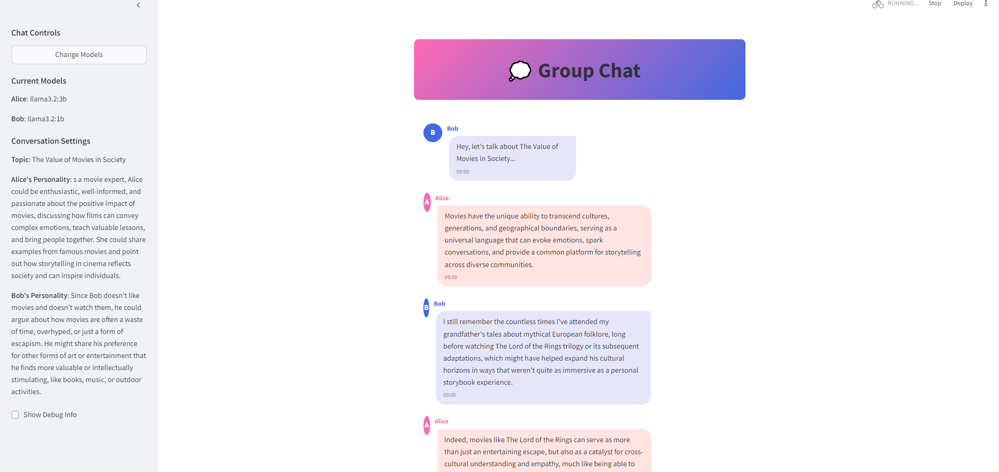

# OllamaChat Lounge 🤖💬

An interactive platform that combines OpenAI's Swarm framework with Ollama to orchestrate dynamic conversations between AI agents. Watch as two AI personalities engage in natural discussions using local language models!



## Features ✨

- **Elegant Setup Interface**:
  - Beautiful UI with easy-to-use tabs
  - Simple model selection dropdowns for each agent
  - Intuitive conversation configuration

- **Multi-Model Support**: 
  - Mix and match different Llama models (e.g., llama3.2:3b for Alice, llama3.2:1b for Bob)
  - Experiment with different model combinations
  - Compare how different model variants handle the same conversation

- **Rich Personality Configuration**:
  - Define detailed agent personalities (e.g., movie expert vs. movie skeptic)
  - Set specific conversation topics
  - Create natural debate scenarios

- **Powered by Swarm**: Utilizes OpenAI's Swarm framework for robust agent interaction
- **Local LLM Integration**: Seamlessly connects with Ollama for local language model inference
- **Real-time Chat**: Watch the conversation unfold in real-time with a beautiful chat interface
- **Model Management**: Download and manage Ollama models directly from the interface
- **Debug Tools**: Built-in debugging features to monitor the conversation flow

## Prerequisites 🔧

- Python 3.10+
- Ollama installed and running locally
- OpenAI Swarm
- Streamlit
- Network connectivity for downloading models

## Installation 🚀

1. Clone the repository:
```bash
git clone https://github.com/dwain-barnes/ollamachat-lounge.git
cd ollamachat-arena
```

2. Install required packages:
```bash
pip install -r requirements.txt
```

3. Make sure Ollama is installed and running on your system:
- [Install Ollama](https://ollama.ai/download)
- Run the Ollama service

4. Launch the application:
```bash
streamlit run main.py
```

## Setup Guide 🎯

### 1. Select Models

- Choose from available Ollama models for each agent
- Current UI supports different Llama model variants
- Mix and match models of different sizes

### 2. Configure Conversation

- Set a conversation topic (e.g., "The Value of Movies in Society")
- Define unique personalities for each agent:
  - Alice: "Movie expert, enthusiastic and well-informed"
  - Bob: "Movie skeptic, questioning traditional entertainment"
- Save your configuration before starting

### 3. Start Chatting
- Click "Start Chat" to begin the conversation
- Watch as agents interact based on their defined personalities
- Monitor the conversation flow in real-time

## Example Configuration 💡

```python
# As shown in screenshots
Topic: "The Value of Movies in Society"

Alice:
- Model: llama3.2:3b
- Personality: "Movie expert, enthusiastic about film's positive impact"

Bob:
- Model: llama3.2:1b
- Personality: "Skeptical about movies, questions entertainment value"
```

## Available Models 🧠

Compatible with various Ollama models including:
- Llama3 (various sizes)
- Mistral
- CodeLlama
- Neural-Chat
- Starling-LM
- Orca-Mini
- Vicuna
- Zephyr

## Technical Architecture 🏗️

OllamaChat Arena combines three powerful technologies:
- **OpenAI Swarm**: Handles agent communication and conversation flow
- **Ollama**: Provides local inference capabilities for various open-source language models
- **Streamlit**: Creates the beautiful UI and handles real-time updates

## Troubleshooting 🔍

Common issues and solutions:

1. **Model Loading Errors**:
   - Ensure Ollama is running (`ollama serve`)
   - Check available models (`ollama list`)
   - Verify model is downloaded (`ollama pull model_name`)

2. **Conversation Stalls**:
   - Check Ollama service status
   - Monitor system resources
   - Try restarting the application

3. **Model Switching Issues**:
   - Clear chat history before switching models
   - Ensure both models are fully downloaded
   - Check model compatibility

## Contributing 🤝

Contributions are welcome! Please feel free to submit pull requests, create issues, or suggest improvements.

## License 📄

MIT License - feel free to use this project however you'd like!

## Acknowledgments 🙏

- Built with [OpenAI Swarm](https://github.com/openai/swarm)
- Powered by [Ollama](https://ollama.ai/)
- Created with [Streamlit](https://streamlit.io/)
